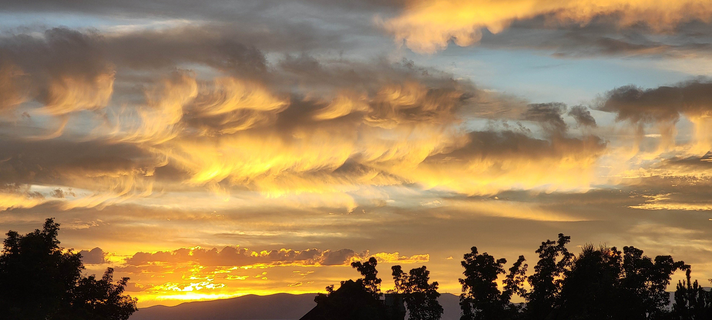

During the years working with the young adults, we went camping regularly.

It wasn’t because it was a crowd favorite, nor was it the most convenient thing to organize.

We did it because of a conversation with another leader at a backyard wedding reception.

The newlyweds were using their leader’s home as the venue.

The property was located in the Tree Streets neighborhood, framed by mature trees and a gently sloped yard that drifted from east to west. As the evening wore on and the celebration settled, I found the homeowner and began comparing notes.

Foremost on my mind as a new leader was a simple question:

> *How do you bring young people together in a way that allows genuine courtships to form and lead to marriage?*

He smiled and shared that his unit held dozens of weddings the past year.

I was all ears.



------------------------------------------------------------------------

He shared their secret: they went camping as a group.

For reasons he couldn’t fully articulate, nature seemed to break down barriers, allowing young people to get acquainted almost effortlessly.

He didn’t need to elaborate—the results he quoted were enough for me.

Inspired by his advice, I began searching for campsites that fit a set of constraints:

1.  **Accessibility:** The campsite had to be within a one-hour drive of our home base.

2.  **Co-ed Accommodations:** The location needed to safely and comfortably host both young men and women in the same general area.

In the end, three locations met our criteria.

One was a traditional outdoor campsite, while the other two offered a hybrid experience with the comfort of indoor plumbing and sleeping facilities.

With our venues selected, we were ready to put his theory to the test.

```{r}
library(leaflet)

leaflet() |>
  addTiles() |>

  addMarkers(
    lng = -111.55135,
    lat = 40.71069,
    popup = "Snydermill Recreation Camp"
  ) |>

  addMarkers(
    lng = -111.26267,
    lat = 40.46596,
    popup = "Heber Valley Camp"
  ) |>

  addMarkers(
    lng = -111.23708,
    lat = 40.48112,
    popup = "Lake Creek Recreation Camp"
  ) |>

  fitBounds(
    lng1 = -111.55135,
    lat1 = 40.46596,
    lng2 = -111.23708,
    lat2 = 40.71069
  )

```
